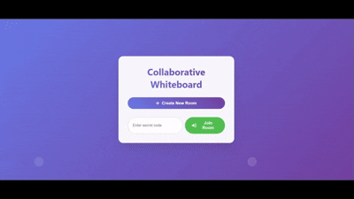

# 🖊️ Collaborative Whiteboard App

A real-time collaborative whiteboard that allows multiple users to draw, write, and interact on a shared canvas over the internet. Built with Firebase Realtime Database and Express.js for live updates and secure room-based sessions.

---

## 🎥 Live Demo



[Demo Link]- (https://realtime-colab-whiteboard.netlify.app/index.html)
---

## 🚀 Features

- ✅ **Create or Join Rooms** using unique secret codes
- ✏️ **Freehand Drawing**, Eraser, Text Tool, Rectangle, and Circle support
- 🎨 **Color Picker** and Adjustable Brush Size
- 🔁 **Undo, Redo**, and ✨ **Clear Canvas**
- 💾 **Save Whiteboard** as PNG
- 🔗 **Shareable Room Link** for real-time collaboration
- 🔐 **Room Access Control** using generated secrets

---

## 🧰 Tech Stack

### 🔹 Frontend
- HTML, CSS, JavaScript (Vanilla)
- [Font Awesome](https://fontawesome.com) for icons
- Firebase Realtime Database (for drawing data + user presence)

### 🔹 Backend
- Node.js with Express.js
- Firebase Admin SDK (via REST)
- Hosted **frontend** on [Netlify](https://netlify.app) and **backend** on [Railway](https://railway.app)

---

## 🔧 Local Setup Instructions

### 1. 📦 Clone the Repo

```bash
git clone https://github.com/debabrata04/Collaborative-Whiteboard.git
cd collaborative-whiteboard

### Local Setup Guide: Collaborative Whiteboard Project

Follow these steps to run both frontend and backend locally:

---

### **Prerequisites**
1. **Node.js** (v18+)
2. **Firebase Account** (for Realtime Database)
3. **Git** (optional)

---

### **1. Clone Repository (if applicable)**
```bash
git clone https://github.com/your-username/your-repo.git
cd your-repo
```

---

### **2. Backend Setup**

#### A. Navigate to backend directory
```bash
cd backend
```

#### B. Install dependencies
```bash
npm install
```

#### C. Create `.env` file
Create a `.env` file in `backend/api/` with your Firebase credentials:
```env
FIREBASE_API_KEY=your_api_key
FIREBASE_AUTH_DOMAIN=your_project_id.firebaseapp.com
FIREBASE_DATABASE_URL=https://your_project_id.firebaseio.com
FIREBASE_PROJECT_ID=your_project_id
FIREBASE_STORAGE_BUCKET=your_project_id.appspot.com
FIREBASE_MESSAGING_SENDER_ID=your_sender_id
FIREBASE_APP_ID=1:your_app_id:web:your_web_id
FIREBASE_MEASUREMENT_ID=G-your_measurement_id
PORT=3001
```

> 🔑 Get credentials from: Firebase Console → Project Settings → Your Apps → SDK setup and configuration

#### D. Start backend server
```bash
node api/index.js
```

**Verify**: Open [http://localhost:3001/api/rooms](http://localhost:3001/api/rooms) in Postman (POST request)

---

### **3. Frontend Setup**

#### A. Navigate to frontend directory
```bash
cd ../frontend
```

#### B. Modify API configuration
In `app.js`, update the API_BASE_URL:
```javascript
// Before:
// API_BASE_URL = 'https://backendcolab...'

// After:
let API_BASE_URL;
if (window.location.hostname === "localhost" || window.location.hostname === "127.0.0.1") {
  API_BASE_URL = 'http://localhost:3001';
} else {
  API_BASE_URL = 'https://your-production-backend.com';
}
```

#### C. Serve frontend
Use Live Server (VS Code extension) or Python HTTP server:
```bash
# Python 3
python -m http.server 3000
```

**Access frontend**: [http://localhost:3000](http://localhost:3000)

---

### **4. Firebase Configuration**

1. Go to [Firebase Console](https://console.firebase.google.com/)
2. Update Realtime Database Rules:
   ```json
   {
     "rules": {
       ".read": true,
       ".write": true
     }
   }
   ```
3. Add localhost to Auth Domains:
   - Authentication → Settings → Authorized domains
   - Add `localhost`

---

### **5. Test Local Workflow**
1. Open [http://localhost:3000](http://localhost:3000)
2. Click "Create New Room"
3. Should redirect to `whiteboard.html?room=...&secret=...`
4. Verify drawing syncs in Firebase Realtime Database

---

### **Troubleshooting**

| Issue | Solution |
|-------|----------|
| CORS errors | Ensure `http://localhost:3000` is in backend's allowedOrigins |
| Firebase connection fails | Verify `.env` credentials match Firebase project |
| Buttons not working | Check browser console for errors (F12) |
| Database not updating | Check Firebase rules are public (temporarily) |
| Canvas not loading | Ensure whiteboard.js imports firebase-config.js |

---
